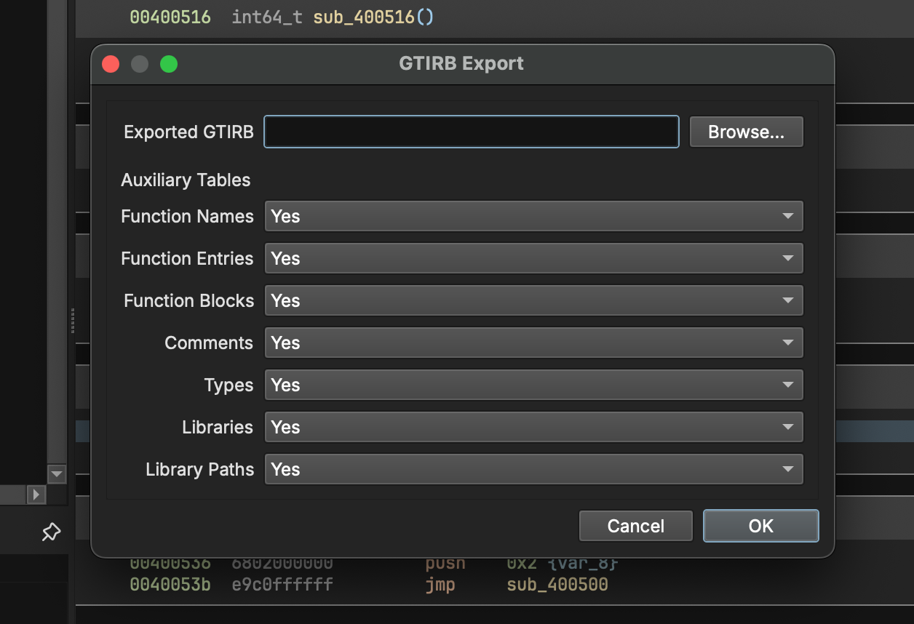

# Binary Ninja GTIRB
Author: **Adrian Herrera**

_Support the GrammaTech Intermediate Representation for Binaries (GTIRB) in Binary Ninja_

## Description:

The [GrammaTech Intermediate Representation for Binaries](https://grammatech.github.io/prj/gtirb/) (GTIRB) is a format for binary analysis and rewriting.
This plugin adds support for the GTIRB format to Binary Ninja.
It is based on GrammaTech's [GTIRB Ghidra plugin](https://github.com/GrammaTech/gtirb-ghidra-plugin).
Currently, it supports exporting a Binary Ninja database to GTIRB.
Importing GTIRB is not (yet) supported.
Similarly, the plugin only support exporting a single module; exporting multiple (linked) modules could be supported via Binary Ninja's [external links](https://docs.binary.ninja/guide/projects.html#external-links) feature, but this is not (yet) supported.

## Installation Instructions

This plugin is available in the Binary Ninja Plugin Manager.
Otherwise:
1. `git clone` this repository into your Binary Ninja plugins folder (see [here](https://docs.binary.ninja/guide/plugins.html) for more details).
1. Install the requirements with `pip install -r requirements.txt`.

## Usage

Open the GTIRB → Export dialog.
Select the location of the exported GTIRB IR file.
Select the [auxiliary tables](https://grammatech.github.io/gtirb/md__aux_data.html) you want to export.
The more auxiliary tables, the longer the export will take.

## License

This plugin is released under a MIT license.
